# 🖥️ Team SuperNova의 Node.js 백오피스 프로젝트

## 프로젝트 소개

- 프로젝트 이름 : 댕냥이를 부탁해
- 내용 : Node.js를 이용한 반려동물 집사들과 펫시터 매칭 서비스
- 구분 : 팀 프로젝트
- GitHub : https://github.com/jkc-mycode/Petsitter_Project
- 시연 영상 : https://www.youtube.com/watch?v=0Agllx6hWM8
- 배포 : https://www.mymycode.shop/api (API 명세서 참고)

 

## 팀원 구성

- 팀장 : 김정찬 [@jkc-mycode](https://github.com/jkc-mycode)
- 팀원 : 안지윤 [@komiharuu](https://github.com/komiharuu)
- 팀원 : 유승엽 [@seungyeopyoo](https://github.com/seungyeopyoo)
- 팀원 : 송사무엘 [@SaintSSong](https://github.com/SaintSSong)
- 팀원 : 엄혜인 [@Eomhyein](https://github.com/Eomhyein)

 

## 1. 개발 기간

- 2024.06.17 ~ 2024.06.20

 

## 2. 개발 환경

- 운영체제 : Window/Mac
- FrontEnd : X
- BackEnd : Node.js, Express, MySQL(Prisma)
- Tool : Visual Studio Code, Insomnia, DBeaver, AWS/S3
- Publish : PM2, AWS/RDS, AWS/EC2, AWS/load balancer

 

## 3. 역할 분배

- **김정찬**
  - 펫서터 조회(검색) 구현
  - 펫시터 목록 조회 구현
  - 펫시터 상세 조회 구현
  - 펫시터 정보 수정 구현
  - 펫시터 예약 현황 조회 구현
  - 펫시터 예약 상태 변경 구현
  - 펫시터 자격증 추가, 조회, 수정, 삭제 구현
  - README 작성
- **안지윤**
  - 펫시터 회원가입 구현
  - 펫시터 로그인 / 로그아웃 구현
  - 펫시터 토큰 재발급 구현
  - 사용자 본인 정보 조회 구현
  - 사용자 본인 정보 수정 구현
  - 발표 PPT 제작
- **유승엽**
  - 사용자 예약 생성 구현
  - 사용자 예약 목록 조회 구현
  - 사용자 예약 상세 조회 구현
  - 사용자 예약 수정 구현
  - 사용자 예약 삭제 구현
  - 시연 영상 촬영
- **송사무엘**
  - 사용자 회원가입 구현
  - 사용자 로그인 / 로그아웃 구현
  - 사용자 토큰 재발급 구현
  - 발표 진행
- **엄혜인**
  - 사용자 리뷰 생성 구현
  - 사용자 리뷰 조회 구현
  - 사용자 리뷰 수정 구현
  - 사용자 리뷰 삭제 구현

 

## 4. API 명세서 및 ERD, 와이어 프레임

- API 명세서 : https://west-territory-778.notion.site/Team-SuperNova-Node-js-2e4bd4ba9a84478ab0d6659cb0edd4b6?pvs=4

- ERD : https://drawsql.app/teams/nodejs-express/diagrams/-3

 

## 5. 주요 기능 및 설명

### 5-1. 사용자 회원가입 API
- **Controller 코드**
- 사용자에게 이메일, 비밀번호, 비밀번호 확인, 별명을 `req.body`로 받아옵니다.
- Service에 입력받은 데이터를 넘깁니다.
- https://github.com/jkc-mycode/Petsitter_Project/blob/a31ae2110db26d03bc3bf5f12a7a119a332e27a5/src/controllers/auth.controller.js#L7-L20

 

- **Service 코드**
- 사용자에게 입력 받은 이메일이 이메일 양식에 맞는지 검사합니다.
- Repository에 회원가입에 필요한 데이터를 넘깁니다.
- https://github.com/jkc-mycode/Petsitter_Project/blob/a31ae2110db26d03bc3bf5f12a7a119a332e27a5/src/services/auth.service.js#L12-L36

 

- **Repository 코드**
- 사용자가 입력한 데이터를 데이터베이스에 저장합니다.
- https://github.com/jkc-mycode/Petsitter_Project/blob/a31ae2110db26d03bc3bf5f12a7a119a332e27a5/src/repositories/user.repository.js#L8-L19

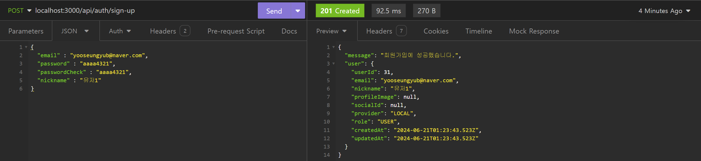

 

### 5-2. 로그인 API
- **Controller 코드**
- 사용자에게 이메일, 비밀번호를 `req.body`로 받아옵니다.
- Service에 입력받은 데이터를 넘깁니다.
- https://github.com/jkc-mycode/Petsitter_Project/blob/a31ae2110db26d03bc3bf5f12a7a119a332e27a5/src/controllers/auth.controller.js#L22-L44

 

- **Service 코드**
- 사용자가 입력한 이메일이 양식에 맞는게 검사합니다.
- 이메일 중복 체크를 위해서 Repository에게 이메일을 넘깁니다.
- `bcrypt`를 통해서 데이터베이스의 해싱된 비밀번호와 입력한 비밀번호를 비교합니다.
- 이메일과 비밀번호가 정상적이면 Access Token과 Refresh Token를 발급해 반환합니다.
- Refresh Token은 데이터베이스에서 관리합니다.
- https://github.com/jkc-mycode/Petsitter_Project/blob/a31ae2110db26d03bc3bf5f12a7a119a332e27a5/src/services/auth.service.js#L38-L86

 

- **Repository 코드**
- 이메일 중복을 체크하기 위해서 이메일 데이터를 받아 옵니다.
- https://github.com/jkc-mycode/Petsitter_Project/blob/a31ae2110db26d03bc3bf5f12a7a119a332e27a5/src/repositories/user.repository.js#L21-L30
- Refresh Token을 받아서 데이터베이스에 저장합니다.
- https://github.com/jkc-mycode/Petsitter_Project/blob/a31ae2110db26d03bc3bf5f12a7a119a332e27a5/src/repositories/user.repository.js#L53-L69

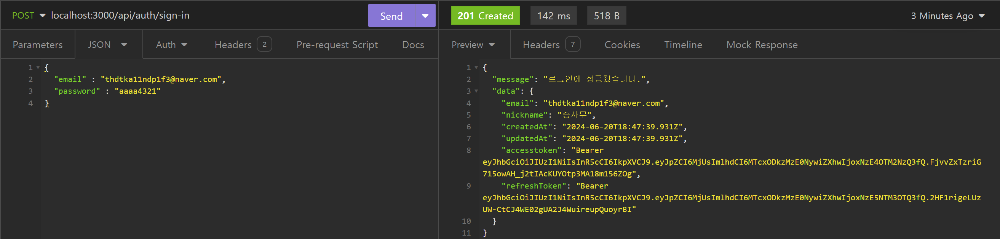

 

### 5-3. 로그아웃 API
- **Controller 코드**
- 입력된 Refresh Token를 통해서 `req.user`에서 사용자의 ID를 가져옵니다.
- 가져온 사용자 ID를 Service에 넘깁니다.
- https://github.com/jkc-mycode/Petsitter_Project/blob/a31ae2110db26d03bc3bf5f12a7a119a332e27a5/src/controllers/auth.controller.js#L60-L75

 

- **Service 코드**
- 별 다른 로직 없이 Repository에 사용자 ID를 넘깁니다.
- https://github.com/jkc-mycode/Petsitter_Project/blob/a31ae2110db26d03bc3bf5f12a7a119a332e27a5/src/services/auth.service.js#L101-L111

 

- **Repository 코드**
- 로그아웃은 사용자의 Refresh Token을 삭제한다는 것을 의미합니다.
- 즉, 데이터베이승의 Refresh Token을 삭제합니다.
- https://github.com/jkc-mycode/Petsitter_Project/blob/a31ae2110db26d03bc3bf5f12a7a119a332e27a5/src/repositories/user.repository.js#L71-L83

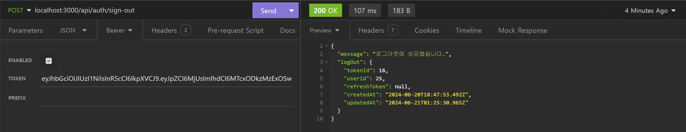

 

### 5-4. 토큰 재발급 API
- **Controller 코드**
- Refresh Token을 통해 사용자의 정보를 `req.user`로 가져옵니다.
- 사용자 ID를 새롭게 토큰을 생성하기 위해서 Service에 넙깁니다.
- https://github.com/jkc-mycode/Petsitter_Project/blob/a31ae2110db26d03bc3bf5f12a7a119a332e27a5/src/controllers/auth.controller.js#L46-L58

 

- **Service 코드**
- 받아온 사용자 ID를 통해서 새로운 Access Token과 Refresh Token을 받아옵니다.
- Refresh Token은 해싱해서 데이터베이스에 하기 위해 Repositorry에 토큰을 넘깁니다.
- https://github.com/jkc-mycode/Petsitter_Project/blob/a31ae2110db26d03bc3bf5f12a7a119a332e27a5/src/services/auth.service.js#L88-L99

 

- **Repository 코드**
- 받아온 사용자 ID와 토큰을 Refresh Token 데이터베이스에 저장합니다.
- https://github.com/jkc-mycode/Petsitter_Project/blob/a31ae2110db26d03bc3bf5f12a7a119a332e27a5/src/services/auth.service.js#L88-L99

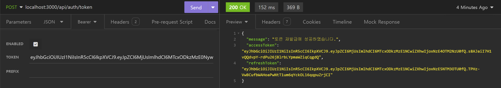

 

### 5-5. 펫시터 회원가입 API
- **Controller 코드**
- 펫시터 전용 회원가입을 위해 이메일, 패스워드, 이름, 경력, 소개 제목, 소개 내용, 지역, 가격, 총 평점을 `req.body`를 통해 받아옵니다.
- 그대로 회원가입에 필요한 데이터를 Service에 넘깁니다.
- https://github.com/jkc-mycode/Petsitter_Project/blob/a31ae2110db26d03bc3bf5f12a7a119a332e27a5/src/controllers/petsitter.auth.controller.js#L10-L42

 

- **Service 코드**
- Controller에서 받아온 데이터 중 이메일을 통해서 해당 펫시터가 존재하는지 검사합니다.
- 받아온 비밀번호를 암호화 해서 나머지 데이터와 함께 Repository로 넘깁니다.
- 반환할 때는 비밀번호 필드는 삭제해서 반환합니다.
- https://github.com/jkc-mycode/Petsitter_Project/blob/a31ae2110db26d03bc3bf5f12a7a119a332e27a5/src/services/petsitter.auth.service.js#L11-L49

 

- **Repository 코드**
- Service에서 받아온 데이터를 기반으로 펫시터를 데이터베이스에서 생성합니다.
- https://github.com/jkc-mycode/Petsitter_Project/blob/a8eafee3d773a280010f8a3c6607757e9bdf013c/src/repositories/petsitter.auth.repository.js#L6-L34

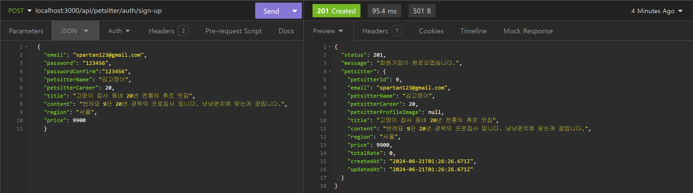

 

### 5-6. 펫시터 로그인 API
- **Controller 코드**
- 펫시터에게 이메일과 비밀번호를 `req.body`를 통해서 받아옵니다.
- 로그인을 위해서 Service에 이메일과 비밀번호를 넘깁니다.
- https://github.com/jkc-mycode/Petsitter_Project/blob/a8eafee3d773a280010f8a3c6607757e9bdf013c/src/controllers/petsitter.auth.controller.js#L44-L58

 

- **Service 코드**
- 받아온 이메일로 실제로 존재하는 펫시터인지 조회하기 위해 Repository에 이메일을 넘깁니다.
- Repository에서 받아온 펫시터 데이터를 기반으로 비밀번가 일치하는지 검사합니다.
- 위 과정이 통과되면 Access Token과 Refresh Token을 생성해서 반환합니다.
- https://github.com/jkc-mycode/Petsitter_Project/blob/a31ae2110db26d03bc3bf5f12a7a119a332e27a5/src/services/petsitter.auth.service.js#L51-L92

 

- **Repository 코드**
- 받아온 이메일이 펫시터 데이터베이스에 존재하는 시 조회합니다.
- 펫시터 ID와 해싱된 Refresh Token을 가져와서 Refresh Token 테이블에 저장합니다.
- https://github.com/jkc-mycode/Petsitter_Project/blob/a8eafee3d773a280010f8a3c6607757e9bdf013c/src/repositories/petsitter.auth.repository.js#L36-L60

 

### 5-7. 펫시터 로그아웃 API
- **Controller 코드**
- 펫시터의 Refresh Token을 통해 가져온 `req.petsitter`를 통해서 펫시터 ID를 Service에 넘깁니다.
- https://github.com/jkc-mycode/Petsitter_Project/blob/a8eafee3d773a280010f8a3c6607757e9bdf013c/src/controllers/petsitter.auth.controller.js#L60-L72

 

- **Service 코드**
- 데이터베이스에서 Refresh Token을 삭제하기 위해 받아온 펫시터 ID를 Repository에 넘깁니다.
- https://github.com/jkc-mycode/Petsitter_Project/blob/a31ae2110db26d03bc3bf5f12a7a119a332e27a5/src/services/petsitter.auth.service.js#L94-L105

 

- **Repository 코드**
- 받아온 펫시터 ID를 통해 데이터베이스에 해당 Refresh Token을 찾아서 token 컬럼부분을 null로 바꿔줍니다. (로그아웃과 같은 의미, soft delete)
- https://github.com/jkc-mycode/Petsitter_Project/blob/a8eafee3d773a280010f8a3c6607757e9bdf013c/src/repositories/petsitter.auth.repository.js#L78-L86

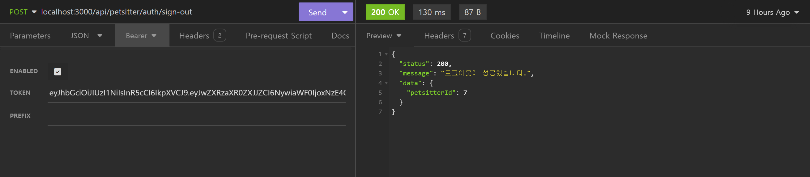

 

### 5-8. 펫시터 토큰 재발급 API
- **Controller 코드**
- 펫시터가 토큰을 재발급받기 위한 API입니다.
- 펫시터의 Refresh Token을 통해 가져온 `req.petsitter`를 통해서 펫시터 ID를 Service에 넘깁니다.
- https://github.com/jkc-mycode/Petsitter_Project/blob/a8eafee3d773a280010f8a3c6607757e9bdf013c/src/controllers/petsitter.auth.controller.js#L74-L90

 

- **Service 코드**
- jwt를 통해서 새로운 토큰을 발급 받습니다.
- Refresh Token은 데이터베이스에 저장하기 위해서 해싱처리 합니다.
- https://github.com/jkc-mycode/Petsitter_Project/blob/a31ae2110db26d03bc3bf5f12a7a119a332e27a5/src/services/petsitter.auth.service.js#L107-L127

 

- **Repository 코드**
- Refresh Token은 재발급 받았기에 데이터베이스에서 업데이트를 해줍니다.
- https://github.com/jkc-mycode/Petsitter_Project/blob/a8eafee3d773a280010f8a3c6607757e9bdf013c/src/repositories/petsitter.auth.repository.js#L46-L60

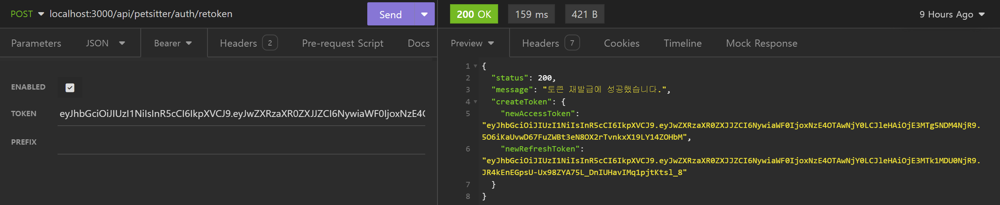

 

### 5-9. 사용자 본인 정보 조회 API
- **Controller 코드**
- 사용자가 사용자 본인의 정보를 조회하는 API입니다.
- 사용자로부터 이메일, 비밀번호, 비밀번호 확인, 닉네임을 `req.body`를 통해 받아옵니다.
- 비밀번호와 비밀번호 확인이 일치하면 데이터들을 Service로 넘깁니다.
- https://github.com/jkc-mycode/Petsitter_Project/blob/a8eafee3d773a280010f8a3c6607757e9bdf013c/src/controllers/user.controller.js#L10-L32

 

- **Service 코드**
- 사용자에게 받은 비밀번호를 암호화해서 데이터베이스를 수정하기 위해 Repository로 넘깁니다.
- https://github.com/jkc-mycode/Petsitter_Project/blob/a8eafee3d773a280010f8a3c6607757e9bdf013c/src/services/user.service.js#L10-L42

 

- **Repository 코드**
- Service에서 받아온 데이터를 사용자 정보를 수정하기 위해서 데이터베이스에 접근합니다.
- https://github.com/jkc-mycode/Petsitter_Project/blob/a8eafee3d773a280010f8a3c6607757e9bdf013c/src/repositories/user.repository.js#L96-L109

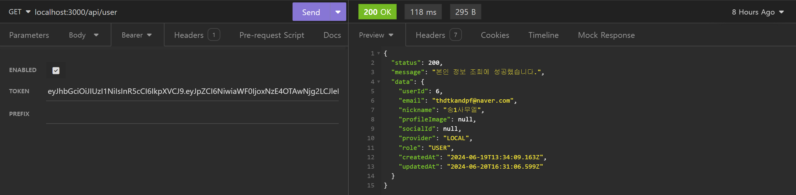

 

### 5-10. 사용자 본인 정보 수정 API
- **Controller 코드**
- 사용자가 사용자 본인의 정보를 수정하는 API입니다.
- Access Token을 통해 사용자 정보를 `req.user`에 담아서 가져옵니다.
- 단순하게 사용자의 정보를 반환하기 위해서 해당 사용자 ID를 Service에 넘깁니다.
- https://github.com/jkc-mycode/Petsitter_Project/blob/a8eafee3d773a280010f8a3c6607757e9bdf013c/src/controllers/user.controller.js#L36-L47

 

- **Service 코드**
- 사용자 ID로 사용자를 조회하기 위해서 Repository에 사용자 ID를 넘깁니다.
- https://github.com/jkc-mycode/Petsitter_Project/blob/a8eafee3d773a280010f8a3c6607757e9bdf013c/src/services/user.service.js#L44-L66

 

- **Repository 코드**
- 받아온 사용자 ID를 기반으로 사용자 테이블에서 데이터를 가져옵니다.
- https://github.com/jkc-mycode/Petsitter_Project/blob/a8eafee3d773a280010f8a3c6607757e9bdf013c/src/repositories/user.repository.js#L85-L94

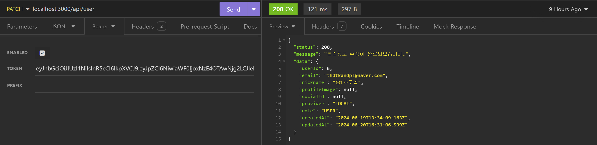

 

### 5-11. 펫시터 조회(검색) API
- **Controller 코드**
- 사용자가 검색이나 필터링을 통해 펫시터 정보를 찾는 API입니다.
- 펫시터를 검색하기 위해 이름, 지역, 가격, 경력을 `req.query`에 담아서 가져옵니다.
- 각 검색 조건은 하나씩만 사용 가능합니다.
- 조건문을 통해서 어떤 조건이냐에 따라서 where절에 사용할 조건 객체를 다르게 설정합니다.
- https://github.com/jkc-mycode/Petsitter_Project/blob/a8eafee3d773a280010f8a3c6607757e9bdf013c/src/controllers/petsitter.controller.js#L72-L102

 

- **Service 코드**
- 조건문을 통해 Controller에서 where절 조건 객체를 가져옵니다.
- 펫시터 검색을 위해서 Repository에 조건 객체를 넘깁니다.
- https://github.com/jkc-mycode/Petsitter_Project/blob/a8eafee3d773a280010f8a3c6607757e9bdf013c/src/services/petsitter.service.js#L141-L146

 

- **Repository 코드**
- 가져온 where절 객체를 가져와서 그대로 where에 넣어서 검색을 합니다.
- https://github.com/jkc-mycode/Petsitter_Project/blob/a8eafee3d773a280010f8a3c6607757e9bdf013c/src/repositories/petsitter.repository.js#L133-L142

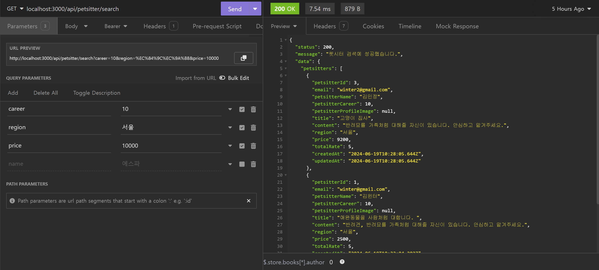

 

### 5-12. 펫시터 목록 조회 API
- **Controller 코드**
- 사용자가 펫시터의 전체 목록을 조회하는 API입니다.
- 펫시터 목록을 정렬하기 위한 조건을 `req.query`를 통해 받아옵니다.
- 마찬가지로 where절에 넣을 조건 객체를 만들어서 정렬에 따른 객체를 만들어 줍니다.
- 해당 조건을 Service에 그대로 넘깁니다.
- https://github.com/jkc-mycode/Petsitter_Project/blob/a8eafee3d773a280010f8a3c6607757e9bdf013c/src/controllers/petsitter.controller.js#L10-L53

 

- **Service 코드**
- 펫시터 목록 조회를 위해 Controller에서 가져온 조건 객체를 Repository에 넘깁니다.
- https://github.com/jkc-mycode/Petsitter_Project/blob/a8eafee3d773a280010f8a3c6607757e9bdf013c/src/services/petsitter.service.js#L9-L30

 

- **Repository 코드**
- Service에서 받아온 where절 조건 객체를 그대로 넣어서 데이터베이스에서 조회합니다.
- https://github.com/jkc-mycode/Petsitter_Project/blob/a8eafee3d773a280010f8a3c6607757e9bdf013c/src/repositories/petsitter.repository.js#L21-L32

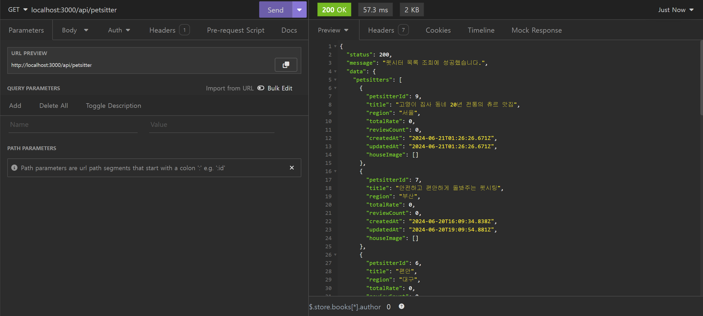

 

### 5-13. 펫시터 상세 조회 API
- **Controller 코드**
- 사용자가 펫시터의 상세 정보를 보기 위한 API입니다.
- 펫시터 상세 조회를 위해  `req.params`를 통해 펫시터 ID를 가져와서 Service에 넘깁니다.
- https://github.com/jkc-mycode/Petsitter_Project/blob/a8eafee3d773a280010f8a3c6607757e9bdf013c/src/controllers/petsitter.controller.js#L55-L70

 

- **Service 코드**
- 가져온 펫시터 ID를 그대로 Repository에 넘깁니다.
- Repository에서 반환된 펫시터 데이터를 가공해서 Controller에 넘깁니다.
- https://github.com/jkc-mycode/Petsitter_Project/blob/a8eafee3d773a280010f8a3c6607757e9bdf013c/src/services/petsitter.service.js#L51-L71

 

- **Repository 코드**
- 받아온 펫시터 ID를 가져와서 데이터베이스에서 조회를 합니다.
- 이때, 자격증 정보, 집 사진, 리뷰, 예약과 같은 정보도 같이 가져옵니다.
- https://github.com/jkc-mycode/Petsitter_Project/blob/a8eafee3d773a280010f8a3c6607757e9bdf013c/src/repositories/petsitter.repository.js#L34-L43

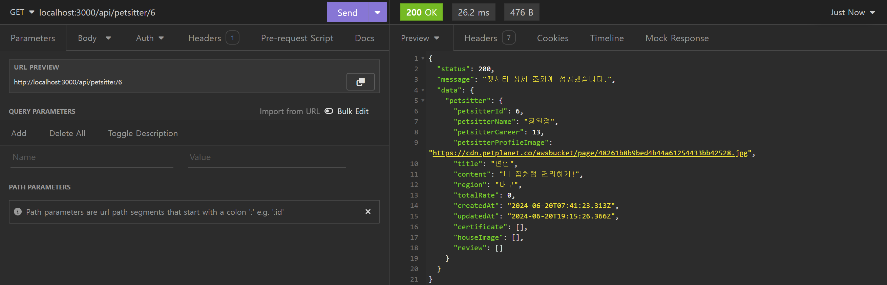

 

### 5-14. 펫시터 본인 정보 조회 API
- **Controller 코드**
- 펫시터가 펫시터 본인의 정보를 조회하는 API입니다.
- 펫시터는 본인의 정보를 조회하기 위해서 Access Token을 통해 생성된 `req.petsitter`에서 펫시터 ID를 가져옵니다.
- 펫시터의 정보를 조회하기 위해서 펫시터 ID를 Service에 넘깁니다.
- https://github.com/jkc-mycode/Petsitter_Project/blob/a8eafee3d773a280010f8a3c6607757e9bdf013c/src/controllers/petsitter.controller.js#L104-L119

 

- **Service 코드**
- 받아온 펫시터 ID를 그대로 Repository에 넘깁니다.
- 필요한 양식에 맞춰서 Controller에게 반환합니다.
- https://github.com/jkc-mycode/Petsitter_Project/blob/a8eafee3d773a280010f8a3c6607757e9bdf013c/src/services/petsitter.service.js#L32-L49

 

- **Repository 코드**
- 받아온 펫시터 ID를 통해 데이터베이스를 조회합니다.
- https://github.com/jkc-mycode/Petsitter_Project/blob/a8eafee3d773a280010f8a3c6607757e9bdf013c/src/repositories/petsitter.repository.js#L10-L32

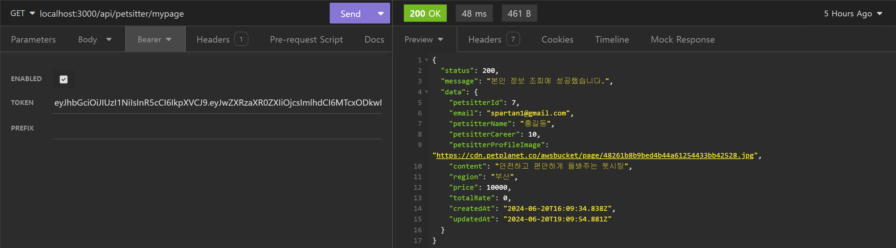

 

### 5-15. 펫시터 수정 API
- **Controller 코드**
- 펫시터가 펫시터 본인의 정보를 수정하는 API입니다.
- 펫시터 정보를 수정하기 위해서 펫시터로부터 펫시터 이름, 경력, 프로필 사진, 소개 제목, 소개 내용, 지역, 가격을 `req.body` 통해 받아옵니다.
- multer 미들웨어를 통해서 이미지 데이터는 `req.files`를 통해 받아옵니다.
- 현재 로그인한 펫시터의 ID는 Access Token을 통해 생성된 `req.petsitter`에서 가져옵니다.
- https://github.com/jkc-mycode/Petsitter_Project/blob/a8eafee3d773a280010f8a3c6607757e9bdf013c/src/controllers/petsitter.controller.js#L121-L161

 

- **Service 코드**
- Controller에서 받아온 데이터를 그대로 Repository로 넘깁니다.
- https://github.com/jkc-mycode/Petsitter_Project/blob/a8eafee3d773a280010f8a3c6607757e9bdf013c/src/services/petsitter.service.js#L73-L102

 

- **Repository 코드**
- 받아온 데이터가 있으면 수정하고 없으면 생략합니다.
- 이때 이미지 테이블에도 데이터를 수정하기 위해서 트랜젝션을 사용합니다.
- https://github.com/jkc-mycode/Petsitter_Project/blob/a8eafee3d773a280010f8a3c6607757e9bdf013c/src/repositories/petsitter.repository.js#L45-L94

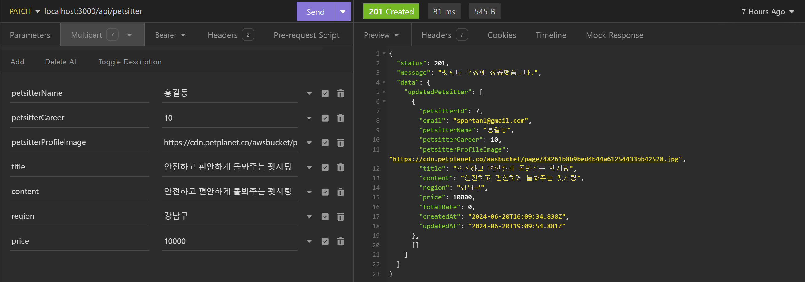

 

### 5-16. 펫시터 예약 현황 조회 API
- **Controller 코드**
- 펫시터가 본인에게 들어온 예약 목록을 확인하는 API입니다.
- 펫시터의 예약 현황을 조회하기 위한 펫시터 ID는 Access Token을 통해 생성된 `req.petsitter`에서 가져옵니다.
- 가져온 펫시터 ID를 그대로 Service로 넘깁니다.
- https://github.com/jkc-mycode/Petsitter_Project/blob/a8eafee3d773a280010f8a3c6607757e9bdf013c/src/controllers/petsitter.controller.js#L163-L178

 

- **Service 코드**
- 받아온 펫시터 ID를 그대로 Repository로 넘깁니다.
- Repository에서 받아온 예약 정보 데이터를 한 번 가공해서 반환합니다.
- https://github.com/jkc-mycode/Petsitter_Project/blob/a8eafee3d773a280010f8a3c6607757e9bdf013c/src/services/petsitter.service.js#L104-L120

 

- **Repository 코드**
- 펫시터 테이블을 통해서 관계된 예약 정보를 가져오기 위해서 중첩 include를 통해서 필요한 데이터들을 같이 가져와서 그대로 반환합니다.
- https://github.com/jkc-mycode/Petsitter_Project/blob/a8eafee3d773a280010f8a3c6607757e9bdf013c/src/repositories/petsitter.repository.js#L96-L112

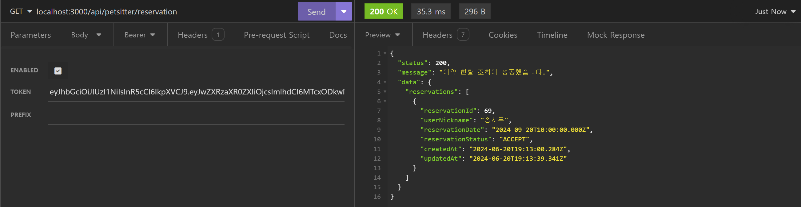

 

### 5-17. 펫시터 예약 상태 변경 API
- **Controller 코드**
- 펫시터가 본인에게 들어온 예약의 상태를 변경하는 API입니다.
- Access Token을 통해서 생성된 `req.petsitter`에서 펫시터 ID를 가져옵니다.
- 펫시터로부터 변경할 예약 ID와 상태를 `req.body`를 통해서 가져옵니다.
- 그렇게 가져온 데이터들을 Service에게 넘깁니다.
- https://github.com/jkc-mycode/Petsitter_Project/blob/a8eafee3d773a280010f8a3c6607757e9bdf013c/src/controllers/petsitter.controller.js#L180-L200

 

- **Service 코드**
- Repository를 통해 예약 ID가 유효한지 확인합니다.
- 예약 데이터의 펫시터와 로그인하 펫시터가 같은지 확인합니다.
- https://github.com/jkc-mycode/Petsitter_Project/blob/a8eafee3d773a280010f8a3c6607757e9bdf013c/src/services/petsitter.service.js#L122-L139

 

- **Repository 코드**
- 받아온 펫시터 ID와, 예약 ID, 변경할 예약 상태를 가져와서 예약 테이블의 데이터를 수정합니다.
- https://github.com/jkc-mycode/Petsitter_Project/blob/a8eafee3d773a280010f8a3c6607757e9bdf013c/src/repositories/petsitter.repository.js#L123-L131

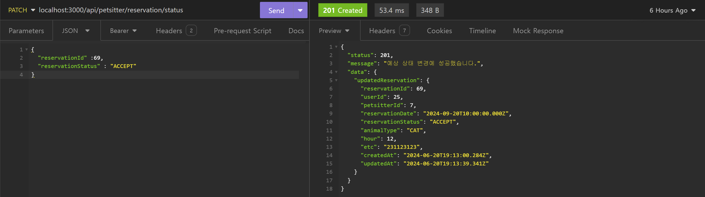

 

### 5-18. 펫시터 자격증 생성 API
- **Controller 코드**
- 펫시터의 자격증 정보를 저장하기 위한 API입니다.
- 펫시터로부터 자격증 이름, 발행처, 발행일을 `req.body`를 통해 받아옵니다.
- multer를 통해서 이미지 데이터를 가져옵니다.
- Access Token을 통해서 펫시터의 정보를 `req.petsitter`에 담아서 가져옵니다.
- https://github.com/jkc-mycode/Petsitter_Project/blob/87564fabee2da5eed4b365adb5d21d0d8a0ec1f6/src/controllers/petsitter.controller.js#L202-L226

 

- **Service 코드**
- Controller에서 받아온 데이터를 Repository에게 넘깁니다.
- 만약 이미지가 없는 경우에는 에러를 반환합니다.
- https://github.com/jkc-mycode/Petsitter_Project/blob/87564fabee2da5eed4b365adb5d21d0d8a0ec1f6/src/services/petsitter.service.js#L148-L166

 

- **Repository 코드**
- 받아온 데이터를 Prisma를 통해 데이터베이스에 저장합니다.
- 그리고 이미지는 한장만 있기 때문에 따로 테이블을 두지 않고 바로 자격증 테이블에 넣습니다.
- https://github.com/jkc-mycode/Petsitter_Project/blob/87564fabee2da5eed4b365adb5d21d0d8a0ec1f6/src/repositories/petsitter.repository.js#L144-L163

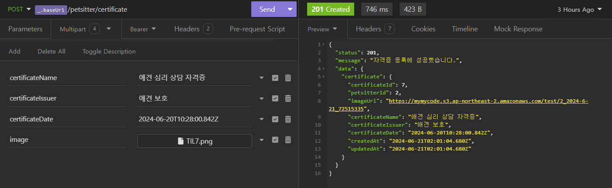

 

### 5-19. 펫시터 자격증 조회 API
- **Controller 코드**
- 로그인한 펫시터 본인이 등록한 자격증들을 조회하는 API입니다.
- Access Token을 통해 생성된  `req.petsitter`에 펫시터 데이터를 담아서 가져옵니다.
- https://github.com/jkc-mycode/Petsitter_Project/blob/87564fabee2da5eed4b365adb5d21d0d8a0ec1f6/src/controllers/petsitter.controller.js#L228-L244

 

- **Service 코드**
- 단순히 Controller에서 받아온 펫시터 ID를 Repositroy에 넘깁니다.
- https://github.com/jkc-mycode/Petsitter_Project/blob/87564fabee2da5eed4b365adb5d21d0d8a0ec1f6/src/services/petsitter.service.js#L171-L176

 

- **Repository 코드**
- Service에서 받아온 펫시터 ID로 자격증 테이블에서 조회를 합니다.
- 이때는 기본적으로 자격증 등록된 시간 순으로 정렬합니다.
- https://github.com/jkc-mycode/Petsitter_Project/blob/87564fabee2da5eed4b365adb5d21d0d8a0ec1f6/src/repositories/petsitter.repository.js#L165-L170

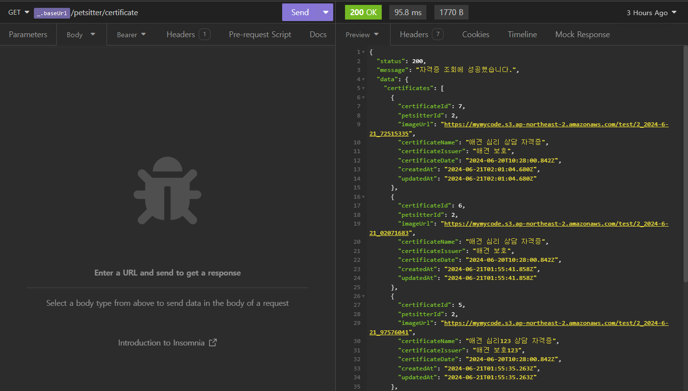

 

### 5-20. 펫시터 자격증 수정 API
- **Controller 코드**
- 펫시터가 등록한 자격증을 수정하는 API입니다.
- 자격증 등록과 마찬가지로 자격증 이름, 발행처, 발행일을 입력받아 `req.body`를 통해 가져옵니다.
- Access Token을 통해서 생성된 `req.petsitter`에 펫시터 데이터를 담아서 가져옵니다.
- https://github.com/jkc-mycode/Petsitter_Project/blob/87564fabee2da5eed4b365adb5d21d0d8a0ec1f6/src/controllers/petsitter.controller.js#L246-L270

 

- **Service 코드**
- 받아온 자격증 ID에 해당하는 자격증이 있는지 검사하기 위해서 Repository에 자격증 ID를 보내서 조회를 합니다.
- 조회되는 자격증이 없으면 에러를 반환합니다.
- https://github.com/jkc-mycode/Petsitter_Project/blob/87564fabee2da5eed4b365adb5d21d0d8a0ec1f6/src/services/petsitter.service.js#L178-L199

 

- **Repository 코드**
- 수정에 필요한 데이터를 가져와서 스프레드 연산자를 통해서 입력받은 데이터만 수정됩니다.
- https://github.com/jkc-mycode/Petsitter_Project/blob/87564fabee2da5eed4b365adb5d21d0d8a0ec1f6/src/repositories/petsitter.repository.js#L184-L205

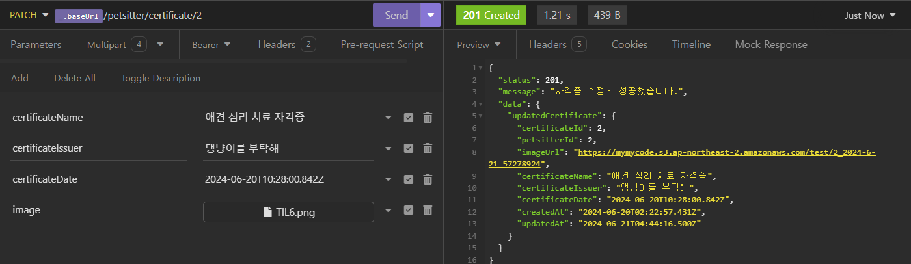

 

### 5-21. 펫시터 자격증 삭제 API
- **Controller 코드**
- Access Token을 통해 생성된 `req.body`에 펫시터 데이터를 담아서 가져옵니다.
- 삭제할 자격증 ID를 `req.params`를 통해서 가져옵니다.
- https://github.com/jkc-mycode/Petsitter_Project/blob/87564fabee2da5eed4b365adb5d21d0d8a0ec1f6/src/controllers/petsitter.controller.js#L272-L292

 

- **Service 코드**
- 펫시터 자격증을 삭제하기 위해서 Controller에서 받아온 데이터를 Repository로 넘깁니다.
- https://github.com/jkc-mycode/Petsitter_Project/blob/87564fabee2da5eed4b365adb5d21d0d8a0ec1f6/src/services/petsitter.service.js#L201-L209

 

- **Repository 코드**
- 펫시터 자격증 삭제 시, 펫시터 ID와 자격증 ID가 모두일치하는 데이터를 삭제합니다.
- https://github.com/jkc-mycode/Petsitter_Project/blob/87564fabee2da5eed4b365adb5d21d0d8a0ec1f6/src/repositories/petsitter.repository.js#L207-L215

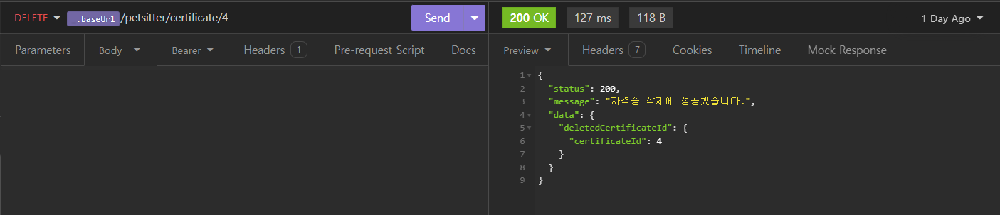

 

### 5-22. 예약 생성 API
- **Controller 코드**
- 사용자가 특정 펫시터에게 예약을 하기 위한 API입니다.
- 사용자에게 펫시터 ID, 예약 날짜, 동물 타입, 시간, 특이사항을 `req.body`를 통해서 받아옵니다.
- https://github.com/jkc-mycode/Petsitter_Project/blob/87564fabee2da5eed4b365adb5d21d0d8a0ec1f6/src/controllers/reservation.controller.js#L9-L35

 

- **Service 코드**
- 사용자가 예약을 생성할 때, 펫시터가 이미 그 날짜에 예약을 수락하면 예약 생성을 하지 못하도록 합니다.
- https://github.com/jkc-mycode/Petsitter_Project/blob/87564fabee2da5eed4b365adb5d21d0d8a0ec1f6/src/services/reservation.service.js#L8-L28

 

- **Repository 코드**
-  Service에서 받아온 데이터를 기반으로 데이터베이스에 예약 정보를 생성합니다.
-  https://github.com/jkc-mycode/Petsitter_Project/blob/87564fabee2da5eed4b365adb5d21d0d8a0ec1f6/src/repositories/reservation.repository.js#L6-L9

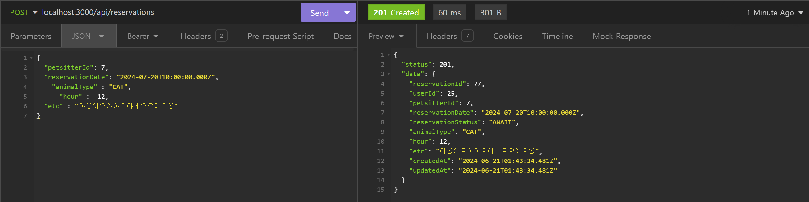

 

### 5-23. 예약 목록 조회 API
- **Controller 코드**
- 사용자가 본인이 등록한 예약을 조회하기 위한 API입니다.
- Access Token으로 생성된 `req.user`를 통해서 사용자 ID를 가져옵니다.
- 그리고 쿼리에 작성된 정렬 방식 또한 `req.query`를 통해 가져옵니다.
- https://github.com/jkc-mycode/Petsitter_Project/blob/87564fabee2da5eed4b365adb5d21d0d8a0ec1f6/src/controllers/reservation.controller.js#L37-L57

 

- **Service 코드**
- 사용자의 예약 내역이 없으면 에러를 반환합니다.
- https://github.com/jkc-mycode/Petsitter_Project/blob/87564fabee2da5eed4b365adb5d21d0d8a0ec1f6/src/services/reservation.service.js#L30-L38

 

- **Repository 코드**
- Service에서 받아온 사용자 ID와 정렬 조건을 가지고 예약 데이터를 조회힙니다.
- https://github.com/jkc-mycode/Petsitter_Project/blob/87564fabee2da5eed4b365adb5d21d0d8a0ec1f6/src/repositories/reservation.repository.js#L11-L19

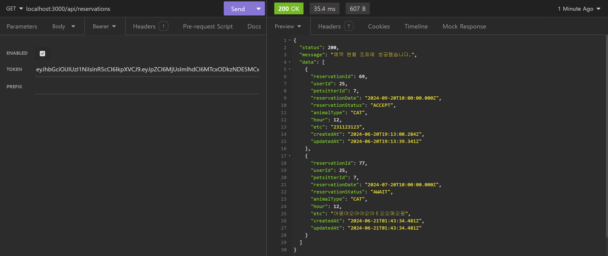

 

### 5-24. 예약 상세 조회 API
- **Controller 코드**
- 사용자의 예약 정보를 상세 조회하는 API입니다.
- Access Token을 통해서 생성된 `req.user`에서 사용자 ID를 가져옵니다.
- 상세 조회할 예약을 알기 위해 `req.params`에서 예약 ID를 가져옵니다.
- https://github.com/jkc-mycode/Petsitter_Project/blob/87564fabee2da5eed4b365adb5d21d0d8a0ec1f6/src/controllers/reservation.controller.js#L59-L79

 

- **Service 코드**
- Controller에서 가져온 예약 ID와 사용자 ID를 기반으로 조회해서 데이터가 없으면 에러를 반환합니다.
- https://github.com/jkc-mycode/Petsitter_Project/blob/87564fabee2da5eed4b365adb5d21d0d8a0ec1f6/src/services/reservation.service.js#L40-L50

 

- **Repository 코드**
- Service에서 받아온 데이터를 기반으로 특정 예약 데이터를 조회합니다.
- https://github.com/jkc-mycode/Petsitter_Project/blob/87564fabee2da5eed4b365adb5d21d0d8a0ec1f6/src/repositories/reservation.repository.js#L21-L29

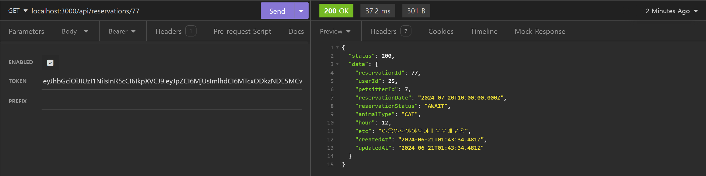

 

### 5-25. 예약 수정 API
- **Controller 코드**
- Access Token를 통해서 생성된 `req.user`에서 사용자 ID를 가져옵니다.
- 수정할 예약을 알기 위해 `req.params`에서 예약 ID를 가져옵니다.
- 수정할 데이터를 `req.body`를 통해서 가져옵니다.
- 상세 조회할 예약을 알기 위해 `req.params`에서 예약 ID를 가져옵니다.
- https://github.com/jkc-mycode/Petsitter_Project/blob/87564fabee2da5eed4b365adb5d21d0d8a0ec1f6/src/controllers/reservation.controller.js#L81-L106

 

- **Service 코드**
- Controller에서 받아온 데이터 중 정말로 수정에 필요한 데이터를 분리합니다.
- 그리고 자기 자신이 예약한 것이 맞는지 검사합니다.
- 예약 상태가 AWAIT 상태가 아니면 수정이 불가하게 합니다.
- https://github.com/jkc-mycode/Petsitter_Project/blob/87564fabee2da5eed4b365adb5d21d0d8a0ec1f6/src/services/reservation.service.js#L52-L89

 

- **Repository 코드**
- Service에서 가공해서 받아온 데이터를 기반으로 데이터베이스의 예약 정보를 수정합니다.
- https://github.com/jkc-mycode/Petsitter_Project/blob/87564fabee2da5eed4b365adb5d21d0d8a0ec1f6/src/repositories/reservation.repository.js#L31-L40

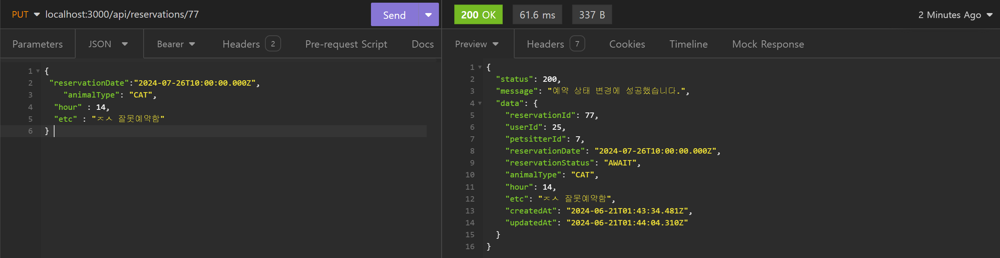

 

### 5-26. 예약 삭제 API
- **Controller 코드**
- 사용자가 본인이 예약한 정보를 삭제(취소)하기 위한 API입니다.
- Access Token를 통해서 생성된 `req.user`에서 사용자 ID를 가져옵니다.
- 삭제할 예약을 알기 위해 `req.params`에서 예약 ID를 가져옵니다.
- https://github.com/jkc-mycode/Petsitter_Project/blob/87564fabee2da5eed4b365adb5d21d0d8a0ec1f6/src/controllers/reservation.controller.js#L108-L131

 

- **Service 코드**
- 예약 상태가 AWAIT이 아니면 삭제가 불가하게 합니다.
- https://github.com/jkc-mycode/Petsitter_Project/blob/87564fabee2da5eed4b365adb5d21d0d8a0ec1f6/src/services/reservation.service.js#L91-L104

 

- **Repository 코드**
-  Service에서 받아온 데이터를 기반으로 데이터베이스에서 예약 정보를 삭제합니다.
-  https://github.com/jkc-mycode/Petsitter_Project/blob/87564fabee2da5eed4b365adb5d21d0d8a0ec1f6/src/repositories/reservation.repository.js#L42-L50

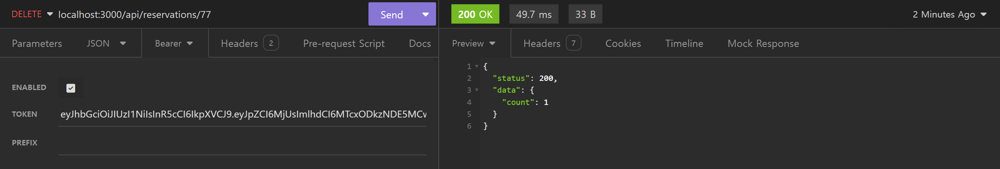

 

### 5-27. 리뷰 생성 API
- **Controller 코드**
- 사용자가 예약한 펫시터에 대한 리뷰를 작성하는 API입니다.
- 어떤 예약에 리뷰를 생성할지를 알기 위해 `req.params`로 예약 ID를 가져옵니다.
- Access Token을 통해 생성된 `req.user`에서 사용자 ID를 가져옵니다.
- 사용자가 입력한 리뷰 내용과 평점을 `req.body`를 통해서 가져옵니다.
- https://github.com/jkc-mycode/Petsitter_Project/blob/6b1022dfebfc4f39d978f305962f6f01900513e4/src/controllers/review.controller.js#L11-L39

 

- **Service 코드**
- 예약 당 하나의 리뷰를 달 수 있기 때문에 리뷰가 이미 존재하지 검사합니다.
- https://github.com/jkc-mycode/Petsitter_Project/blob/6b1022dfebfc4f39d978f305962f6f01900513e4/src/services/review.service.js#L11-L28

 

- **Repository 코드**
- Service에서 받아온 데이터를 기반으로 데이터베이스에 리뷰 정보를 생성합니다.
- https://github.com/jkc-mycode/Petsitter_Project/blob/6b1022dfebfc4f39d978f305962f6f01900513e4/src/repositories/review.repository.js#L6-L17

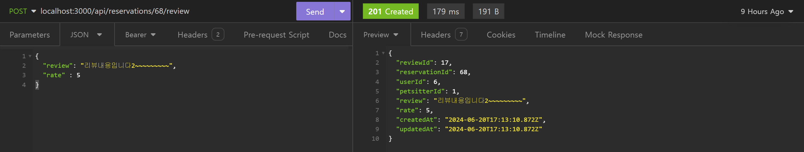

 

### 5-28. 리뷰 조회 API
- **Controller 코드**
- 로그인한 사용자가 본인이 작성한 리뷰을 확인하기 위한 API입니다.
- 어떤 예약에 리뷰를 작성했는지 알기 위해 `req.params`로 예약 ID를 가져옵니다.
- Access Token을 통해 생성된 `req.user`에서 사용자 ID를 가져옵니다.
- https://github.com/jkc-mycode/Petsitter_Project/blob/6b1022dfebfc4f39d978f305962f6f01900513e4/src/controllers/review.controller.js#L41-L61

 

- **Service 코드**
- 리뷰를 조회하기 위해 가져온 데이터를 그대로 Repository에 넘깁니다.
- 만약 조회된 리뷰가 없을 경우 에러를 반환합니다.
- https://github.com/jkc-mycode/Petsitter_Project/blob/6b1022dfebfc4f39d978f305962f6f01900513e4/src/services/review.service.js#L35-L43

 

- **Repository 코드**
- 예약 ID와 사용자 ID를 기반으로 데이터베이스에서 리뷰 정보를 조회합니다.
- https://github.com/jkc-mycode/Petsitter_Project/blob/6b1022dfebfc4f39d978f305962f6f01900513e4/src/repositories/review.repository.js#L41-L54

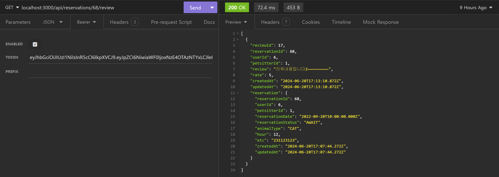

 

### 5-29. 리뷰 수정 API
- **Controller 코드**
- 로그인한 사용자가 작성한 리뷰의 정보를 수정하기 위한 API입니다.
- 어떤 리뷰를 수정할지 알기 위해 `req.params`로 리뷰 ID를 가져옵니다.
- Access Token을 통해 생성된 `req.user`에서 사용자 ID를 가져옵니다.
- https://github.com/jkc-mycode/Petsitter_Project/blob/6b1022dfebfc4f39d978f305962f6f01900513e4/src/controllers/review.controller.js#L63-L88

 

- **Service 코드**
- 해당 리뷰가 존재하는지 확인하고 리뷰를 작성한 사용자가 로그인한 사용자와 일치하는지 검사합니다.
- https://github.com/jkc-mycode/Petsitter_Project/blob/6b1022dfebfc4f39d978f305962f6f01900513e4/src/services/review.service.js#L51-L67

 

- **Repository 코드**
- 받아온 데이터를 기반으로 데이터베이스의 리뷰 정보를 수정합니다.
- https://github.com/jkc-mycode/Petsitter_Project/blob/6b1022dfebfc4f39d978f305962f6f01900513e4/src/repositories/review.repository.js#L56-L63

 

### 5-30. 리뷰 삭제 API
- **Controller 코드**
- 로그인한 사용자가 본인이 작성한 리뷰를 삭제하기 위한 API입니다.
- 어떤 리뷰를 삭제할지 알기 위해 `req.params`로 리뷰 ID를 가져옵니다.
- Access Token을 통해 생성된 `req.user`에서 사용자 ID를 가져옵니다.
- https://github.com/jkc-mycode/Petsitter_Project/blob/6b1022dfebfc4f39d978f305962f6f01900513e4/src/controllers/review.controller.js#L89-L109

 

- **Service 코드**
- 해당 리뷰가 존재하는지 확인하고 리뷰를 작성한 사용자가 로그인한 사용자와 일치하는지 검사합니다.
- https://github.com/jkc-mycode/Petsitter_Project/blob/6b1022dfebfc4f39d978f305962f6f01900513e4/src/services/review.service.js#L69-L83

 

- **Repository 코드**
- 받아온 리뷰 ID와 사용자 ID를 기반으로 데이터베이스의 리뷰 정보를 삭제합니다.
- https://github.com/jkc-mycode/Petsitter_Project/blob/6b1022dfebfc4f39d978f305962f6f01900513e4/src/repositories/review.repository.js#L65-L70

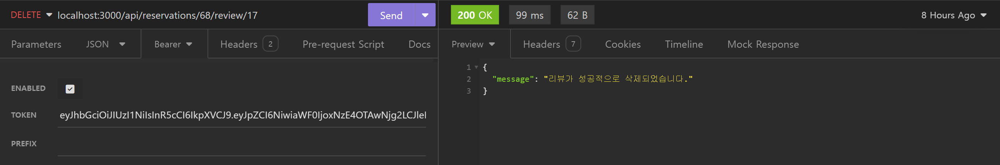

 

=======================추가 사항=======================

 

### 5-31. 유저 역할 수정 API
- **Controller 코드**
- 사용자의 역할과 데이터를 수정하기 위한 API입니다.
- 이 API는 USER 이상의 존재가 사용자의 역할을 수정할 수 있도록 합니다.
- 어떤 사용자를 수정할지 알기 위해 `req.params`로 사용자 ID를 가져옵니다.
- Access Token을 통해 생성된 `req.user`에서 사용자 데이터를 가져옵니다.
- https://github.com/jkc-mycode/Petsitter_Project/blob/fdebf1d668966a201851cee4351192f7f6374a59/src/controllers/user.controller.js#L9-L41

 

- **Service 코드**
- 받아온 사용자 ID를 기반으로 존재하는 사용자인지 검사합니다.
- 들어온 비밀번호는 `bcrypt`를 통해 암호화 합니다.
- 수정에 필요한 데이터를 Repository에게 넘깁니다.
- https://github.com/jkc-mycode/Petsitter_Project/blob/fdebf1d668966a201851cee4351192f7f6374a59/src/services/user.service.js#L9-L39

 

- **Repository 코드**
- Service로부터 받아온 데이터를 기반으로 데이터베이스의 사용자 정보를 수정합니다.
- https://github.com/jkc-mycode/Petsitter_Project/blob/fdebf1d668966a201851cee4351192f7f6374a59/src/repositories/user.repository.js#L109-L121

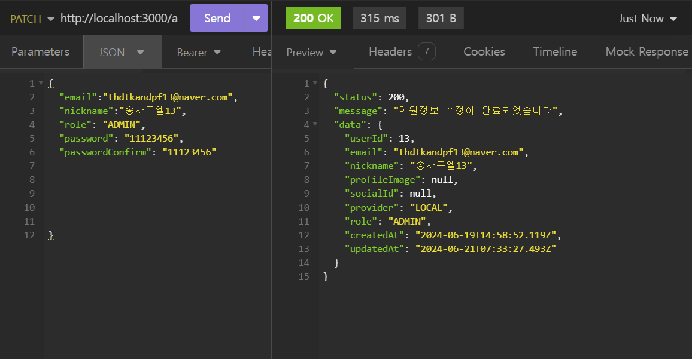

 

### 5-32. 관리자 문의 생성 API
- **Controller 코드**
- 사용자가 관리자에게 문의하기 위한 API입니다.
- ADMIN 관리자가 이용할 경우 에러를 발생합니다.
- 문의 제목과 내용을 `req.body`를 통해 가져옵니다.
- Access Token을 통해 생성된 `req.user`에서 사용자 데이터를 가져옵니다.
- https://github.com/jkc-mycode/Petsitter_Project/blob/fdebf1d668966a201851cee4351192f7f6374a59/src/controllers/admin.controller.js#L8-L25

 

- **Service 코드**
- Controller에서 받아온 데이터를 그대로 Repository에 넘깁니다.
- 반환된 데이터는 양식에 맞도록 수정해서 Controller에게 반환합니다.
- https://github.com/jkc-mycode/Petsitter_Project/blob/fdebf1d668966a201851cee4351192f7f6374a59/src/services/admin.service.js#L9-L21

 

- **Repository 코드**
- Service에서 받아온 데이터를 기반으로 데이터베이스에 QnA 데이터를 추가합니다.
- https://github.com/jkc-mycode/Petsitter_Project/blob/fdebf1d668966a201851cee4351192f7f6374a59/src/repositories/admin.repository.js#L6-L19

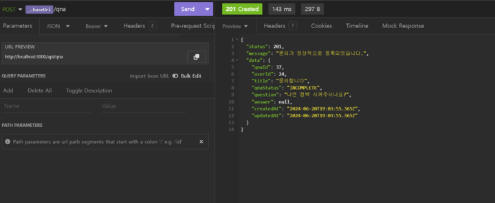

 

### 5-33. 관리자 문의 조회 API
- **Controller 코드**
- 모든 문의를 조회할 수 있는 API입니다.
- 단순하게 Service의 메서드를 호출합니다.
- https://github.com/jkc-mycode/Petsitter_Project/blob/fdebf1d668966a201851cee4351192f7f6374a59/src/controllers/admin.controller.js#L26-L35

 

- **Service 코드**
- 문의 목록을 조회할 때 최신 순으로 정렬시켜서 반환합니다.
- 필요없는 정보가 있기 때문에 양식을 변형해서 반환합니다.
- https://github.com/jkc-mycode/Petsitter_Project/blob/fdebf1d668966a201851cee4351192f7f6374a59/src/services/admin.service.js#L23-L41

 

- **Repository 코드**
- 데이터베이스에 있는 문의 데이터들을 따로 조건없이 가져옵니다.
- https://github.com/jkc-mycode/Petsitter_Project/blob/fdebf1d668966a201851cee4351192f7f6374a59/src/repositories/admin.repository.js#L21-L30

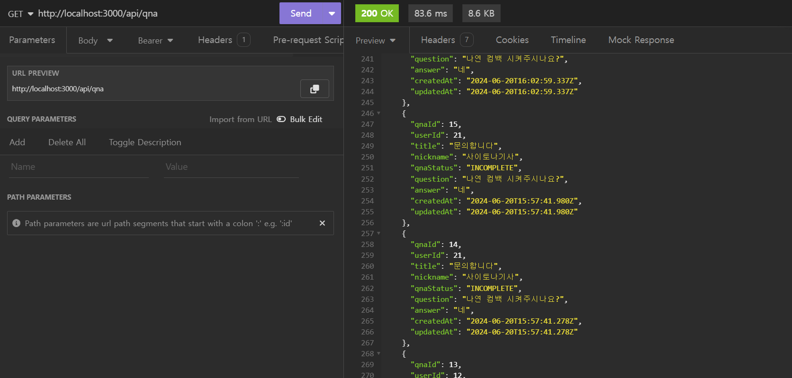

 

### 5-34. 본인 문의내역 조회 API
- **Controller 코드**
- 특정 문의를 조회하는 API입니다.
- Access Token을 통해 생성된 `req.user`에서 사용자 ID를 가져옵니다.
- https://github.com/jkc-mycode/Petsitter_Project/blob/fdebf1d668966a201851cee4351192f7f6374a59/src/controllers/admin.controller.js#L37-L47

 

- **Service 코드**
- 문의의 상세한 내용을 조회하기 위해서 Repository에 사용자 ID를 넘깁니다.
- 최신 순으로 정렬 후 양식을 변경해서 반환합니다.
- https://github.com/jkc-mycode/Petsitter_Project/blob/fdebf1d668966a201851cee4351192f7f6374a59/src/services/admin.service.js#L43-L60

 

- **Repository 코드**
- 받아온 사용자 ID를 기반으로 데이터베이스에서 문의 데이터를 가져옵니다.
- https://github.com/jkc-mycode/Petsitter_Project/blob/fdebf1d668966a201851cee4351192f7f6374a59/src/repositories/admin.repository.js#L42-L50https://github.com/jkc-mycode/Petsitter_Project/blob/fdebf1d668966a201851cee4351192f7f6374a59/src/repositories/admin.repository.js#L42-L50

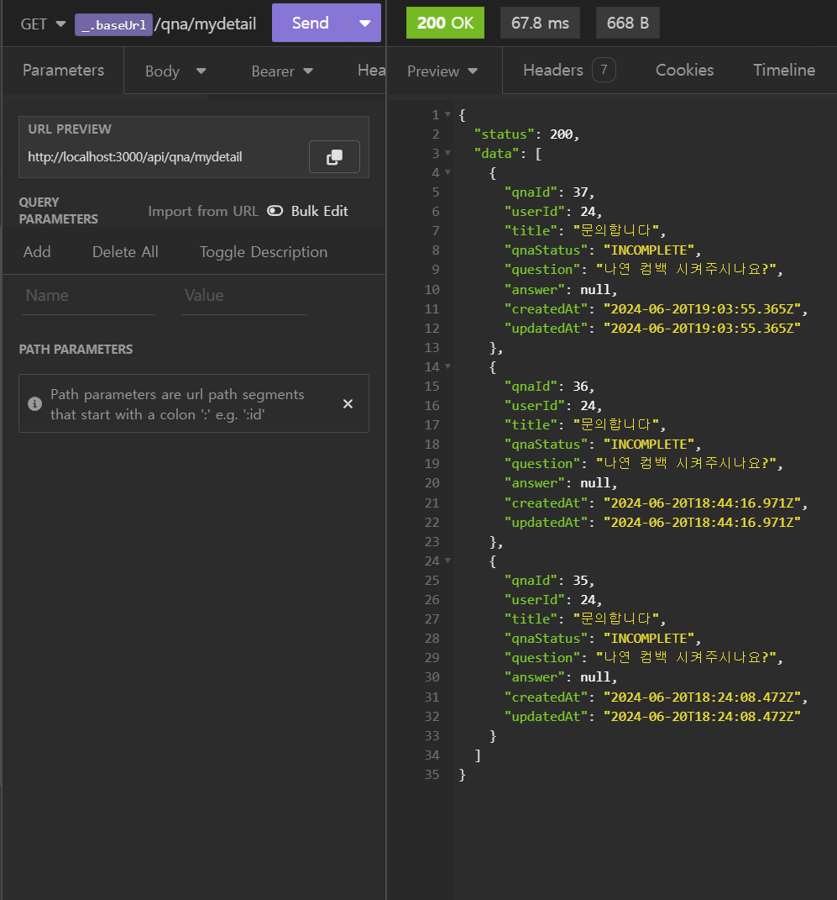

 

### 5-35. 관리자 문의 수정 API
- **Controller 코드**
- 사용자 본인이 작성한 문의 내용을 수정하기 위한 API입니다.
- Access Token을 통해 생성된 `req.user`에서 사용자 역할을 가져옵니다.
- 변경할 문의를 알기 위해 `req.params`를 통해 가져옵니다.
- 수정할 내용 데이터를 `req.body`를 통해 가져옵니다.
- 역할에 따라서 보내는 매개변수를 다르게 사용합니다.
- ADMIN 일 때는 문의 상태를 변경할 수 있는 매개변수를 추가로 보냅니다.
- https://github.com/jkc-mycode/Petsitter_Project/blob/fdebf1d668966a201851cee4351192f7f6374a59/src/controllers/admin.controller.js#L49-L68

 

- **Service 코드**
- Controller에서 받아온 문의 ID를 기반으로 존재하는 문의인지 검사합니다.
- 문의를 수정하기 위해 받아온 데이터를 Repository에 넘깁니다.
- https://github.com/jkc-mycode/Petsitter_Project/blob/fdebf1d668966a201851cee4351192f7f6374a59/src/services/admin.service.js#L62-L88

 

- **Repository 코드**
- Service에서 받아온 데이터를 기반으로 데이터베이스의 문의 정보를 수정합니다.
- 그리고 수정 시 새로 들어온 데이터만 수정하고 입력하지 않으면 수정하지 않습니다.
- https://github.com/jkc-mycode/Petsitter_Project/blob/fdebf1d668966a201851cee4351192f7f6374a59/src/services/admin.service.js#L62-L88

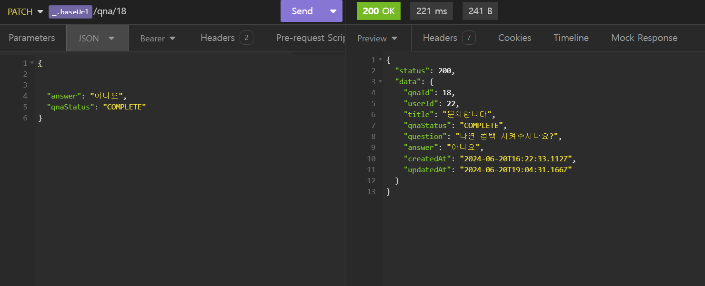

 

### 5-36. 관리자 문의 삭제 API
- **Controller 코드**
- 사용자 또는 관리자가 문의를 삭제하기 위한 API입니다.
- 어떤 문의를 삭제할지 알기 위해 `req.params`로 문의 ID를 가져옵니다.
- https://github.com/jkc-mycode/Petsitter_Project/blob/fdebf1d668966a201851cee4351192f7f6374a59/src/controllers/admin.controller.js#L70-L83

 

- **Service 코드**
- 받아온 문의 ID를 기반으로 존재하는 문의인지 검사합니다.
- https://github.com/jkc-mycode/Petsitter_Project/blob/fdebf1d668966a201851cee4351192f7f6374a59/src/services/admin.service.js#L90-L107

 

- **Repository 코드**
- Service에서 받아온 문의 ID를 기반으로 데이터베이스에서 해당 문의 정보를 삭제합니다.
- 삭제된 데이터를 반환합니다.
- https://github.com/jkc-mycode/Petsitter_Project/blob/fdebf1d668966a201851cee4351192f7f6374a59/src/repositories/admin.repository.js#L69-L78

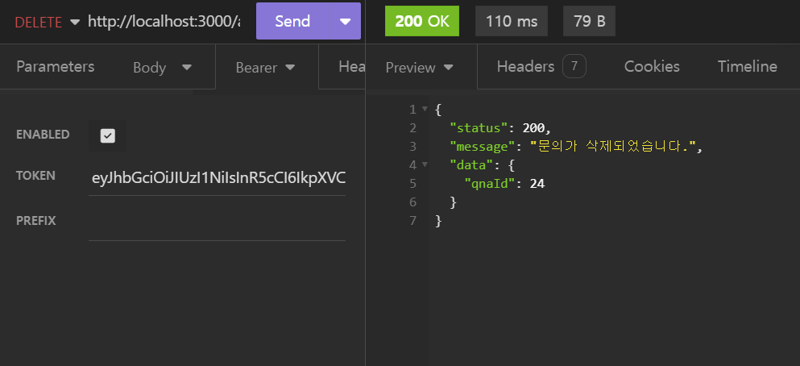

 

## 6. 어려웠던 점 및 소감

### 6-1. jwt 인증과 계층 분리에 대한 어려움 (안지윤)
- 복호화와 jwt 인증을 자세하게 들어가다보니 인증에 대한 개념이 부족했었고, 라우터를  Controller-Service-Repository로 나눌 때 경로가 많이 헷갈렸습니다.  또한 여태껏 공부해 왔던 것들이 빙산의 일각이고 추후 공부해야 될 것들이 많다는 것도 알았습니다. 그리고 repository 쪽에서 argument 관련 내용의 에러가 많이 떴는데, 이를 재빨리 캐치하지 못했습니다. 그리고 평소 알게 된 로직에서 새로운 로직을 구현하는 것이 어려웠다.

- 이번 프로젝트를 하면서 chat gpt 사용을 줄이고,  스스로 생각하면서 코드를 구현하는 힘을 기르게 되었습니다. 코드를 구현 하다가 막히는 부분도 많았는데, 막히는 부분을 도와주신 튜터님들과 팀원분들 모두 감사드립니다.

 

### 6-2. 처음 작성해보는 코드 (송사무엘)
- 기존에 선택 사항이였던 것을 기회가 되어 작성해보았는데 처음 코드를 작성하는 것 이여서 이해와 활용에 많은 난관을 겪어야 했습니다. 하지만 따뜻한 팀원들 간의 관심과 자상하게 알려주는 팀장님의 지식 나눔이 있었기에 무사히 코드를 작성할 수 이었습니다.

- 전체적으로 안 써봤던 기능들을 제한 시간 내에 작성 할 수 있어서 보람을 느낄 수 있던 팀 플레이였습니다. 사전에 약속 해둔 회의 시간을 통하여서 서로의 생각을 공유할 수 있었고 팀 규칙으로 질문하는 것에 어색함이 점차 사라져서 서로의 지식을 공유할 수 있고 그로 인해서 공부하여 지식을 쌓아나가 활용할 수 있는 매우 유익한 시간이였습니다.

 

### 6-3. 계층 분리와 코드의 이해 (엄혜인)
- Controller - Service - Repository로 계층을 나누는데 이해가 부족해 코드 작성시 오래 걸렸고 에러 발생 시 이해도가 떨어져 해결하는데 오래걸렸다. 그리하여 JOI 활용을 시도조차 하지 못한 상황이 되었다.

- 그래도 처음으로 직접 용도에 맞게 코드를 분리해 뿌듯했다. 에러 발생시 직접 해결해 보는 것도 좋지만 오래 걸린다면 빨리 물어서 해결을 하는 게 더 좋은 방법이라는 생각이 든다.

 

### 6-4. 프로젝트의 흐름과 처음 접하는 기능들 (유승엽)
- 기존에 했던 과제나 강의와 다르게 다양한 이용자(이용자, 펫시터, 운영자)를 생각해야해서 프로젝트의 흐름을 이해하는 것이 어려웠습니다. 또 일전에 여러번 해보았던 기능을 다시금 구성하여 기능만 정상 동작하게끔 하는 것은 예상보다 빠르게 완성하였지만
입문, 숙련, 심화 주차 난이도와 관계없이 안해보았던 기능을 구현하는 것은 몇배는 더 어렵다는 것을 배웠습니다.

- 저는 커밋을 작업분기마다 하나의 이슈(브런치)에 누적되게 푸쉬하여 이슈를 적게 생성되고 커밋은 비교적 이슈보다는 많은 깃헙 방식을 사용중이었는데 확실히 이슈(브런치)를 많이 생성하는 것이 더욱 유지보수에도 유리하고 충돌시도 많은 코드를 수정할 필요가 없이 방금 작업한 분기만 병합을 하면 되어서 훨씬 더 가볍게 해결이 가능함을 이번에 습득하였습니다.

- 아쉬운건 JOI를 먼저 만들고 오류를 출력하는 if문을 작성하였으면 반나절 정도는 단축되었을거같은데 반대로 해서 ㅠㅠ시간을 두배로 사용하였습니다ㅠ..
다들 하루도 빠짐없이 늘 새벽까지 자리를 지키고 계셔주시는 팀원들 덕분에 강제로..? 더 과제에 몰입할 수 있었던 것 같습니다.. 다들 잘하시는데 최대한 노오력하시는 것도 그렇고, 새로운 것을 알아가는데에 즐거워하시는 모습과 그것을 갈망하시는 것을 보고 많은 것을 느꼈습니다.

 

### 6-5. 계획, 설계의 부족과 테스트 여러움 (김정찬)
- 구현할 기능들을 충분히 많았기 때문에 팀원들과의 충돌이 많이 생기진 않았지만,
Controller - Service - Repository로 계층을 나눠서 프로젝트를 진행할 때
나눠진 파일들이 생각보다 많아서 파일들을 관리하는 게 생각보다 어려웠다.
분명 팀원들과 파일에 대한 양식을 미리 정했지만 파일의 양이 많아지니 생각처럼
원하는 파일을 쉽게 찾질 못했다.

- 이번 팀프로젝트를 진행하면서 팀원들에게 많은 질문들이 들어왔다.
질문 받는 걸 좋아하지만, 내가 알고 있는 내용을 남들에게 쉽게 설명하는게 엄청 어려웠다.
설명을 최대한 쉽게 하는 것 같지만 팀원들이 이해하기 어려워 하는 때가 있는 것을 보면
튜터님들처럼 무언가를 설명하는 게 정말 어려운 것 같다.

-  분명 팀원들 모두 이번 과제에서 처음 해보는 것들이 많을 텐데 포기하지 않고
계속 물어보면서 방법을 찾으려고 해줘서 정말 고마웠다.
나도 그저 팀원들에게 시간을 쓰는 것이 아니라 일종의 복습 차원에서
공부한다고 생각하기에 더욱 많은 질문은 환영이다.

