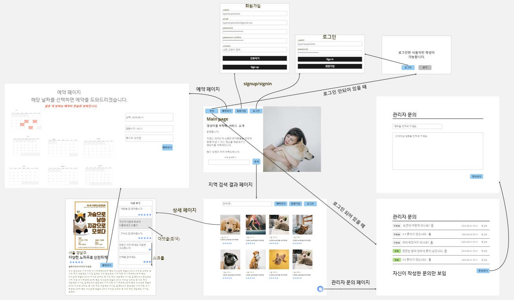

# 🖥️ Team SuperNova의 Node.js 백오피스 프로젝트

## 프로젝트 소개

- 프로젝트 이름 : 댕냥이를 부탁해
- 내용 : Node.js를 이용한 반려동물 집사들과 펫시터 매칭 서비스
- 구분 : 팀 프로젝트
- GitHub : https://github.com/jkc-mycode/Petsitter_Project
- 시연 영상 : 
- 배포 : 

 

## 팀원 구성

- 팀장 : 김정찬 [@jkc-mycode](https://github.com/jkc-mycode)
- 팀원 : 안지윤 [@komiharuu](https://github.com/komiharuu)
- 팀원 : 유승엽 [@seungyeopyoo](https://github.com/seungyeopyoo)
- 팀원 : 송사무엘 [@SaintSSong](https://github.com/SaintSSong)
- 팀원 : 엄혜인 [@Eomhyein](https://github.com/Eomhyein)

 

## 1. 개발 기간

- 2024.06.17 ~ 2024.06.20

 

## 2. 개발 환경

- 운영체제 : Window/Mac
- FrontEnd : X
- BackEnd : Node.js, Express, MySQL(Prisma)
- Tool : Visual Studio Code, Insomnia, DBeaver, AWS/S3
- Publish : PM2, AWS/RDS, AWS/EC2, AWS/load balancer

 

## 3. 역할 분배

- **김정찬**
  - 펫서터 조회(검색) 구현
  - 펫시터 목록 조회 구현
  - 펫시터 상세 조회 구현
  - 펫시터 정보 수정 구현
  - 펫시터 예약 현황 조회 구현
  - 펫시터 예약 상태 변경 구현
  - 펫시터 자격증 추가, 조회, 수정, 삭제 구현
  - README 작성
- **안지윤**
  - 펫시터 회원가입 구현
  - 펫시터 로그인 / 로그아웃 구현
  - 펫시터 토큰 재발급 구현
  - 사용자 본인 정보 조회 구현
  - 사용자 본인 정보 수정 구현
  - 발표 PPT 제작
- **유승엽**
  - 사용자 예약 생성 구현
  - 사용자 예약 목록 조회 구현
  - 사용자 예약 상세 조회 구현
  - 사용자 예약 수정 구현
  - 사용자 예약 삭제 구현
  - 시연 영상 촬영
- **송사무엘**
  - 사용자 회원가입 구현
  - 사용자 로그인 / 로그아웃 구현
  - 사용자 토큰 재발급 구현
  - 발표 진행
- **엄혜인**
  - 사용자 리뷰 생성 구현
  - 사용자 리뷰 조회 구현
  - 사용자 리뷰 수정 구현
  - 사용자 리뷰 삭제 구현

 

## 4. API 명세서 및 ERD, 와이어 프레임

- API 명세서 : 
- ERD : https://drawsql.app/teams/nodejs-express/diagrams/-3

 

## 5. 주요 기능 및 설명

### 5-1. 사용자 회원가입 API
- **Controller 코드**
- 사용자에게 이메일, 비밀번호, 비밀번호 확인, 별명을 `req.body`로 받아옵니다.
- Service에 입력받은 데이터를 넘깁니다.
- https://github.com/jkc-mycode/Petsitter_Project/blob/a31ae2110db26d03bc3bf5f12a7a119a332e27a5/src/controllers/auth.controller.js#L7-L20

 

- **Service 코드**
- 사용자에게 입력 받은 이메일이 이메일 양식에 맞는지 검사합니다.
- Repository에 회원가입에 필요한 데이터를 넘깁니다.
- https://github.com/jkc-mycode/Petsitter_Project/blob/a31ae2110db26d03bc3bf5f12a7a119a332e27a5/src/services/auth.service.js#L12-L36

 

- **Repository 코드**
- 사용자가 입력한 데이터를 데이터베이스에 저장합니다.
- https://github.com/jkc-mycode/Petsitter_Project/blob/a31ae2110db26d03bc3bf5f12a7a119a332e27a5/src/repositories/user.repository.js#L8-L19

 

### 5-2. 로그인 API
- **Controller 코드**
- 사용자에게 이메일, 비밀번호를 `req.body`로 받아옵니다.
- Service에 입력받은 데이터를 넘깁니다.
- https://github.com/jkc-mycode/Petsitter_Project/blob/a31ae2110db26d03bc3bf5f12a7a119a332e27a5/src/controllers/auth.controller.js#L22-L44

 

- **Service 코드**
- 사용자가 입력한 이메일이 양식에 맞는게 검사합니다.
- 이메일 중복 체크를 위해서 Repository에게 이메일을 넘깁니다.
- `bcrypt`를 통해서 데이터베이스의 해싱된 비밀번호와 입력한 비밀번호를 비교합니다.
- 이메일과 비밀번호가 정상적이면 Access Token과 Refresh Token를 발급해 반환합니다.
- Refresh Token은 데이터베이스에서 관리합니다.
- https://github.com/jkc-mycode/Petsitter_Project/blob/a31ae2110db26d03bc3bf5f12a7a119a332e27a5/src/services/auth.service.js#L38-L86

 

- **Repository 코드**
- 이메일 중복을 체크하기 위해서 이메일 데이터를 받아 옵니다.
- https://github.com/jkc-mycode/Petsitter_Project/blob/a31ae2110db26d03bc3bf5f12a7a119a332e27a5/src/repositories/user.repository.js#L21-L30
- Refresh Token을 받아서 데이터베이스에 저장합니다.
- https://github.com/jkc-mycode/Petsitter_Project/blob/a31ae2110db26d03bc3bf5f12a7a119a332e27a5/src/repositories/user.repository.js#L53-L69

 

### 5-3. 로그아웃 API
- **Controller 코드**
- 입력된 Refresh Token를 통해서 `req.user`에서 사용자의 ID를 가져옵니다.
- 가져온 사용자 ID를 Service에 넘깁니다.
- https://github.com/jkc-mycode/Petsitter_Project/blob/a31ae2110db26d03bc3bf5f12a7a119a332e27a5/src/controllers/auth.controller.js#L60-L75

 

- **Service 코드**
- 별 다른 로직 없이 Repository에 사용자 ID를 넘깁니다.
- https://github.com/jkc-mycode/Petsitter_Project/blob/a31ae2110db26d03bc3bf5f12a7a119a332e27a5/src/services/auth.service.js#L101-L111

 

- **Repository 코드**
- 로그아웃은 사용자의 Refresh Token을 삭제한다는 것을 의미합니다.
- 즉, 데이터베이승의 Refresh Token을 삭제합니다.
- https://github.com/jkc-mycode/Petsitter_Project/blob/a31ae2110db26d03bc3bf5f12a7a119a332e27a5/src/repositories/user.repository.js#L71-L83

 

### 5-4. 토큰 재발급 API
- **Controller 코드**
- Refresh Token을 통해 사용자의 정보를 `req.user`로 가져옵니다.
- 사용자 ID를 새롭게 토큰을 생성하기 위해서 Service에 넙깁니다.
- https://github.com/jkc-mycode/Petsitter_Project/blob/a31ae2110db26d03bc3bf5f12a7a119a332e27a5/src/controllers/auth.controller.js#L46-L58

 

- **Service 코드**
- 받아온 사용자 ID를 통해서 새로운 Access Token과 Refresh Token을 받아옵니다.
- Refresh Token은 해싱해서 데이터베이스에 하기 위해 Repositorry에 토큰을 넘깁니다.
- https://github.com/jkc-mycode/Petsitter_Project/blob/a31ae2110db26d03bc3bf5f12a7a119a332e27a5/src/services/auth.service.js#L88-L99

 

- **Repository 코드**
- 받아온 사용자 ID와 토큰을 Refresh Token 데이터베이스에 저장합니다.
- https://github.com/jkc-mycode/Petsitter_Project/blob/a31ae2110db26d03bc3bf5f12a7a119a332e27a5/src/services/auth.service.js#L88-L99

 

### 5-5. 펫시터 회원가입 API
- **Controller 코드**
- 펫시터 전용 회원가입을 위해 이메일, 패스워드, 이름, 경력, 소개 제목, 소개 내용, 지역, 가격, 총 평점을 `req.body`를 통해 받아옵니다.
- 그대로 회원가입에 필요한 데이터를 Service에 넘깁니다.
- https://github.com/jkc-mycode/Petsitter_Project/blob/a31ae2110db26d03bc3bf5f12a7a119a332e27a5/src/controllers/petsitter.auth.controller.js#L10-L42

 

- **Service 코드**
- Controller에서 받아온 데이터 중 이메일을 통해서 해당 펫시터가 존재하는지 검사합니다.
- 받아온 비밀번호를 암호화 해서 나머지 데이터와 함께 Repository로 넘깁니다.
- 반환할 때는 비밀번호 필드는 삭제해서 반환합니다.
- https://github.com/jkc-mycode/Petsitter_Project/blob/a31ae2110db26d03bc3bf5f12a7a119a332e27a5/src/services/petsitter.auth.service.js#L11-L49

 

- **Repository 코드**
- Service에서 받아온 데이터를 기반으로 펫시터를 데이터베이스에서 생성합니다.
- https://github.com/jkc-mycode/Petsitter_Project/blob/a8eafee3d773a280010f8a3c6607757e9bdf013c/src/repositories/petsitter.auth.repository.js#L6-L34

 

### 5-6. 펫시터 로그인 API
- **Controller 코드**
- 펫시터에게 이메일과 비밀번호를 `req.body`를 통해서 받아옵니다.
- 로그인을 위해서 Service에 이메일과 비밀번호를 넘깁니다.
- https://github.com/jkc-mycode/Petsitter_Project/blob/a8eafee3d773a280010f8a3c6607757e9bdf013c/src/controllers/petsitter.auth.controller.js#L44-L58

 

- **Service 코드**
- 받아온 이메일로 실제로 존재하는 펫시터인지 조회하기 위해 Repository에 이메일을 넘깁니다.
- Repository에서 받아온 펫시터 데이터를 기반으로 비밀번가 일치하는지 검사합니다.
- 위 과정이 통과되면 Access Token과 Refresh Token을 생성해서 반환합니다.
- https://github.com/jkc-mycode/Petsitter_Project/blob/a31ae2110db26d03bc3bf5f12a7a119a332e27a5/src/services/petsitter.auth.service.js#L51-L92

 

- **Repository 코드**
- 받아온 이메일이 펫시터 데이터베이스에 존재하는 시 조회합니다.
- 펫시터 ID와 해싱된 Refresh Token을 가져와서 Refresh Token 테이블에 저장합니다.
- https://github.com/jkc-mycode/Petsitter_Project/blob/a8eafee3d773a280010f8a3c6607757e9bdf013c/src/repositories/petsitter.auth.repository.js#L36-L60

 

### 5-7. 펫시터 로그아웃 API
- **Controller 코드**
- 펫시터의 Refresh Token을 통해 가져온 `req.petsitter`를 통해서 펫시터 ID를 Service에 넘깁니다.
- https://github.com/jkc-mycode/Petsitter_Project/blob/a8eafee3d773a280010f8a3c6607757e9bdf013c/src/controllers/petsitter.auth.controller.js#L60-L72

 

- **Service 코드**
- 데이터베이스에서 Refresh Token을 삭제하기 위해 받아온 펫시터 ID를 Repository에 넘깁니다.
- https://github.com/jkc-mycode/Petsitter_Project/blob/a31ae2110db26d03bc3bf5f12a7a119a332e27a5/src/services/petsitter.auth.service.js#L94-L105

 

- **Repository 코드**
- 받아온 펫시터 ID를 통해 데이터베이스에 해당 Refresh Token을 찾아서 token 컬럼부분을 null로 바꿔줍니다. (로그아웃과 같은 의미, soft delete)
- https://github.com/jkc-mycode/Petsitter_Project/blob/a8eafee3d773a280010f8a3c6607757e9bdf013c/src/repositories/petsitter.auth.repository.js#L78-L86

 

### 5-8. 펫시터 토큰 재발급 API
- **Controller 코드**
- 펫시터의 Refresh Token을 통해 가져온 `req.petsitter`를 통해서 펫시터 ID를 Service에 넘깁니다.
- https://github.com/jkc-mycode/Petsitter_Project/blob/a8eafee3d773a280010f8a3c6607757e9bdf013c/src/controllers/petsitter.auth.controller.js#L74-L90

 

- **Service 코드**
- jwt를 통해서 새로운 토큰을 발급 받습니다.
- Refresh Token은 데이터베이스에 저장하기 위해서 해싱처리 합니다.
- https://github.com/jkc-mycode/Petsitter_Project/blob/a31ae2110db26d03bc3bf5f12a7a119a332e27a5/src/services/petsitter.auth.service.js#L107-L127

 

- **Repository 코드**
- Refresh Token은 재발급 받았기에 데이터베이스에서 업데이트를 해줍니다.
- https://github.com/jkc-mycode/Petsitter_Project/blob/a8eafee3d773a280010f8a3c6607757e9bdf013c/src/repositories/petsitter.auth.repository.js#L46-L60

 

### 5-9. 사용자 본인 정보 조회 API
- **Controller 코드**
- 사용자로부터 이메일, 비밀번호, 비밀번호 확인, 닉네임을 `req.body`를 통해 받아옵니다.
- 비밀번호와 비밀번호 확인이 일치하면 데이터들을 Service로 넘깁니다.
- https://github.com/jkc-mycode/Petsitter_Project/blob/a8eafee3d773a280010f8a3c6607757e9bdf013c/src/controllers/user.controller.js#L10-L32

 

- **Service 코드**
- 사용자에게 받은 비밀번호를 암호화해서 데이터베이스를 수정하기 위해 Repository로 넘깁니다.
- https://github.com/jkc-mycode/Petsitter_Project/blob/a8eafee3d773a280010f8a3c6607757e9bdf013c/src/services/user.service.js#L10-L42

 

- **Repository 코드**
- Service에서 받아온 데이터를 사용자 정보를 수정하기 위해서 데이터베이스에 접근합니다.
- https://github.com/jkc-mycode/Petsitter_Project/blob/a8eafee3d773a280010f8a3c6607757e9bdf013c/src/repositories/user.repository.js#L96-L109

 

### 5-10. 사용자 본인 정보 수정 API
- **Controller 코드**
- Access Token을 통해 사용자 정보를 `req.user`에 담아서 가져옵니다.
- 단순하게 사용자의 정보를 반환하기 위해서 해당 사용자 ID를 Service에 넘깁니다.
- https://github.com/jkc-mycode/Petsitter_Project/blob/a8eafee3d773a280010f8a3c6607757e9bdf013c/src/controllers/user.controller.js#L36-L47

 

- **Service 코드**
- 사용자 ID로 사용자를 조회하기 위해서 Repository에 사용자 ID를 넘깁니다.
- https://github.com/jkc-mycode/Petsitter_Project/blob/a8eafee3d773a280010f8a3c6607757e9bdf013c/src/services/user.service.js#L44-L66

 

- **Repository 코드**
- 받아온 사용자 ID를 기반으로 사용자 테이블에서 데이터를 가져옵니다.
- https://github.com/jkc-mycode/Petsitter_Project/blob/a8eafee3d773a280010f8a3c6607757e9bdf013c/src/repositories/user.repository.js#L85-L94

 

### 5-11. 펫시터 조회(검색) API
- **Controller 코드**
- 펫시터를 검색하기 위해 이름, 지역, 가격, 경력을 `req.query`에 담아서 가져옵니다.
- 각 검색 조건은 하나씩만 사용 가능합니다.
- 조건문을 통해서 어떤 조건이냐에 따라서 where절에 사용할 조건 객체를 다르게 설정합니다.
- https://github.com/jkc-mycode/Petsitter_Project/blob/a8eafee3d773a280010f8a3c6607757e9bdf013c/src/controllers/petsitter.controller.js#L72-L102

 

- **Service 코드**
- 조건문을 통해 Controller에서 where절 조건 객체를 가져옵니다.
- 펫시터 검색을 위해서 Repository에 조건 객체를 넘깁니다.
- https://github.com/jkc-mycode/Petsitter_Project/blob/a8eafee3d773a280010f8a3c6607757e9bdf013c/src/services/petsitter.service.js#L141-L146

 

- **Repository 코드**
- 가져온 where절 객체를 가져와서 그대로 where에 넣어서 검색을 합니다.
- https://github.com/jkc-mycode/Petsitter_Project/blob/a8eafee3d773a280010f8a3c6607757e9bdf013c/src/repositories/petsitter.repository.js#L133-L142

 

### 5-12. 펫시터 목록 조회 API
- **Controller 코드**
- 펫시터 목록을 정렬하기 위한 조건을 `req.query`를 통해 받아옵니다.
- 마찬가지로 where절에 넣을 조건 객체를 만들어서 정렬에 따른 객체를 만들어 줍니다.
- 해당 조건을 Service에 그대로 넘깁니다.
- https://github.com/jkc-mycode/Petsitter_Project/blob/a8eafee3d773a280010f8a3c6607757e9bdf013c/src/controllers/petsitter.controller.js#L10-L53

 

- **Service 코드**
- 펫시터 목록 조회를 위해 Controller에서 가져온 조건 객체를 Repository에 넘깁니다.
- https://github.com/jkc-mycode/Petsitter_Project/blob/a8eafee3d773a280010f8a3c6607757e9bdf013c/src/services/petsitter.service.js#L9-L30

 

- **Repository 코드**
- Service에서 받아온 where절 조건 객체를 그대로 넣어서 데이터베이스에서 조회합니다.
- https://github.com/jkc-mycode/Petsitter_Project/blob/a8eafee3d773a280010f8a3c6607757e9bdf013c/src/repositories/petsitter.repository.js#L21-L32

 

### 5-13. 펫시터 상세 조회 API
- **Controller 코드**
- 펫시터 상세 조회를 위해  `req.params`를 통해 펫시터 ID를 가져와서 Service에 넘깁니다.
- https://github.com/jkc-mycode/Petsitter_Project/blob/a8eafee3d773a280010f8a3c6607757e9bdf013c/src/controllers/petsitter.controller.js#L55-L70

 

- **Service 코드**
- 가져온 펫시터 ID를 그대로 Repository에 넘깁니다.
- Repository에서 반환된 펫시터 데이터를 가공해서 Controller에 넘깁니다.
- https://github.com/jkc-mycode/Petsitter_Project/blob/a8eafee3d773a280010f8a3c6607757e9bdf013c/src/services/petsitter.service.js#L51-L71

 

- **Repository 코드**
- 받아온 펫시터 ID를 가져와서 데이터베이스에서 조회를 합니다.
- 이때, 자격증 정보, 집 사진, 리뷰, 예약과 같은 정보도 같이 가져옵니다.
- https://github.com/jkc-mycode/Petsitter_Project/blob/a8eafee3d773a280010f8a3c6607757e9bdf013c/src/repositories/petsitter.repository.js#L34-L43

 

### 5-14. 펫시터 본인 정보 조회 API
- **Controller 코드**
- 펫시터는 본인의 정보를 조회하기 위해서 Access Token을 통해 생성된 `req.petsitter`에서 펫시터 ID를 가져옵니다.
- 펫시터의 정보를 조회하기 위해서 펫시터 ID를 Service에 넘깁니다.
- https://github.com/jkc-mycode/Petsitter_Project/blob/a8eafee3d773a280010f8a3c6607757e9bdf013c/src/controllers/petsitter.controller.js#L104-L119

 

- **Service 코드**
- 받아온 펫시터 ID를 그대로 Repository에 넘깁니다.
- 필요한 양식에 맞춰서 Controller에게 반환합니다.
- https://github.com/jkc-mycode/Petsitter_Project/blob/a8eafee3d773a280010f8a3c6607757e9bdf013c/src/services/petsitter.service.js#L32-L49

 

- **Repository 코드**
- 받아온 펫시터 ID를 통해 데이터베이스를 조회합니다.
- https://github.com/jkc-mycode/Petsitter_Project/blob/a8eafee3d773a280010f8a3c6607757e9bdf013c/src/repositories/petsitter.repository.js#L10-L32

 

### 5-15. 펫시터 수정 API
- **Controller 코드**
- 펫시터 정보를 수정하기 위해서 펫시터로부터 펫시터 이름, 경력, 프로필 사진, 소개 제목, 소개 내용, 지역, 가격을 `req.body` 통해 받아옵니다.
- multer 미들웨어를 통해서 이미지 데이터는 `req.files`를 통해 받아옵니다.
- 현재 로그인한 펫시터의 ID는 Access Token을 통해 생성된 `req.petsitter`에서 가져옵니다.
- https://github.com/jkc-mycode/Petsitter_Project/blob/a8eafee3d773a280010f8a3c6607757e9bdf013c/src/controllers/petsitter.controller.js#L121-L161

 

- **Service 코드**
- Controller에서 받아온 데이터를 그대로 Repository로 넘깁니다.
- https://github.com/jkc-mycode/Petsitter_Project/blob/a8eafee3d773a280010f8a3c6607757e9bdf013c/src/services/petsitter.service.js#L73-L102

 

- **Repository 코드**
- 받아온 데이터가 있으면 수정하고 없으면 생략합니다.
- 이때 이미지 테이블에도 데이터를 수정하기 위해서 트랜젝션을 사용합니다.
- https://github.com/jkc-mycode/Petsitter_Project/blob/a8eafee3d773a280010f8a3c6607757e9bdf013c/src/repositories/petsitter.repository.js#L45-L94

 

### 5-16. 펫시터 예약 현황 조회 API
- **Controller 코드**
- 펫시터의 예약 현황을 조회하기 위한 펫시터 ID는 Access Token을 통해 생성된 `req.petsitter`에서 가져옵니다.
- 가져온 펫시터 ID를 그대로 Service로 넘깁니다.
- https://github.com/jkc-mycode/Petsitter_Project/blob/a8eafee3d773a280010f8a3c6607757e9bdf013c/src/controllers/petsitter.controller.js#L163-L178

 

- **Service 코드**
- 받아온 펫시터 ID를 그대로 Repository로 넘깁니다.
- Repository에서 받아온 예약 정보 데이터를 한 번 가공해서 반환합니다.
- https://github.com/jkc-mycode/Petsitter_Project/blob/a8eafee3d773a280010f8a3c6607757e9bdf013c/src/services/petsitter.service.js#L104-L120

 

- **Repository 코드**
- 펫시터 테이블을 통해서 관계된 예약 정보를 가져오기 위해서 중첩 include를 통해서 필요한 데이터들을 같이 가져와서 그대로 반환합니다.
- https://github.com/jkc-mycode/Petsitter_Project/blob/a8eafee3d773a280010f8a3c6607757e9bdf013c/src/repositories/petsitter.repository.js#L96-L112

 

### 5-17. 펫시터 예약 상태 변경 API
- **Controller 코드**
- Access Token을 통해서 생성된 `req.petsitter`에서 펫시터 ID를 가져옵니다.
- 펫시터로부터 변경할 예약 ID와 상태를 `req.body`를 통해서 가져옵니다.
- 그렇게 가져온 데이터들을 Service에게 넘깁니다.
- https://github.com/jkc-mycode/Petsitter_Project/blob/a8eafee3d773a280010f8a3c6607757e9bdf013c/src/controllers/petsitter.controller.js#L180-L200

 

- **Service 코드**
- Repository를 통해 예약 ID가 유효한지 확인합니다.
- 예약 데이터의 펫시터와 로그인하 펫시터가 같은지 확인합니다.
- https://github.com/jkc-mycode/Petsitter_Project/blob/a8eafee3d773a280010f8a3c6607757e9bdf013c/src/services/petsitter.service.js#L122-L139

 

- **Repository 코드**
- 받아온 펫시터 ID와, 예약 ID, 변경할 예약 상태를 가져와서 예약 테이블의 데이터를 수정합니다.
- https://github.com/jkc-mycode/Petsitter_Project/blob/a8eafee3d773a280010f8a3c6607757e9bdf013c/src/repositories/petsitter.repository.js#L123-L131

 

### 5-18. 펫시터 자격증 생성 API
- **Controller 코드**
- 

 

- **Service 코드**
- 

 

- **Repository 코드**
- 

 

### 5-19. 펫시터 자격증 조회 API
- **Controller 코드**
- 

 

- **Service 코드**
- 

 

- **Repository 코드**
- 

 

### 5-20. 펫시터 자격증 수정 API
- **Controller 코드**
- 

 

- **Service 코드**
- 

 

- **Repository 코드**
- 

 

### 5-21. 펫시터 자격증 삭제 API

- 

 

### 5-22. 예약 생성 API

- 

 

### 5-23. 예약 목록 조회 API

- 

 

### 5-24. 예약 상세 조회 API

- 

 

### 5-25. 예약 수정 API

- 

 

### 5-26. 예약 삭제 API

- 

 

### 5-27. 리뷰 생성 API

- 

 

### 5-28. 리뷰 조회 API

- 

 

### 5-29. 리뷰 수정 API

- 

 

### 5-30. 리뷰 삭제 API

- 

 

## 6. 어려웠던 점

### 6-1. N:M 관계 vs 1:N 관계의 차이 (김정찬)

- 

 

### 6-2. 소셜 로그인과 기존 인증방식의 호환 (채유일)

- 

 

### 6-3. Prisma 작동 로직의 이해 (구남욱)

- 

 

### 6-4. 계획, 설계의 부족과 테스트 여러움 (복광수)

- 